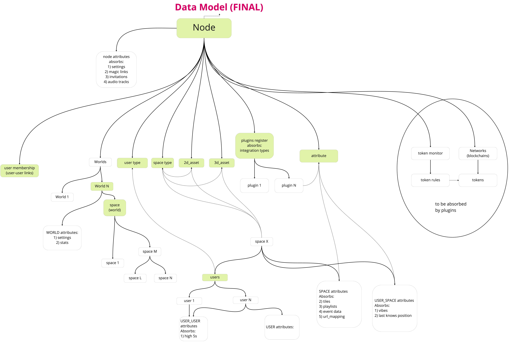

# Components
This application consists of multiple system components that interact with each other. This page gives a general description of the definition of these components.

| Component | Description                                                                                                                            |
|-----------|----------------------------------------------------------------------------------------------------------------------------------------|
| Node      | Nodes are the parent of every entity in the application                                                                                |
| World     | Worlds are children of nodes, worlds hold spaces                                                                                       |
| Space     | Spaces are children of a world, spaces have attributes attached to them. These attributes are used to define a space visually          |
| User      | Users can be associated with worlds and spaces, this is done so access to certain spaces can be controlled                             |
| Plugins   | Plugins are isolated pieces of functionality that belong to a Space, i.e integrations like Google or Miro                              |
| Database  | The database module in the application handles database connections, this module can be used in other modules to make database queries |

For information regarding terminology please consult the 'terminology' page. A diagram representing the structure of the controller can be seen on the image below.

