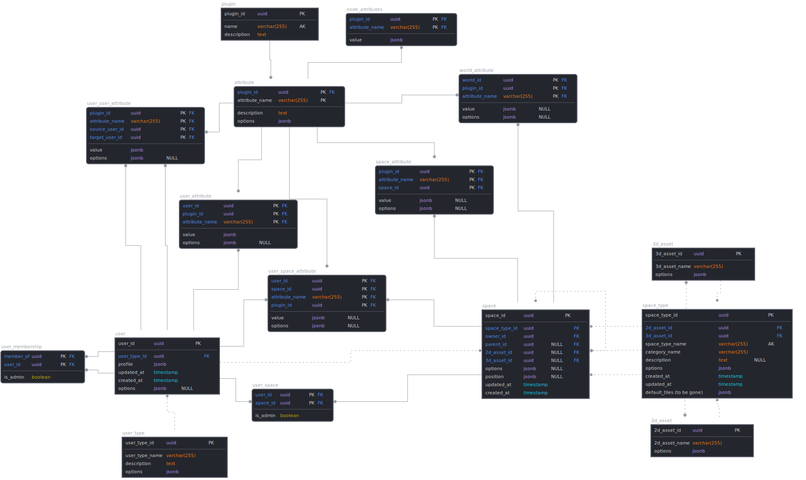

# Database
This page describes how database connections work inside the controller and what is required in order to connect to an instance.

### Prerequisites
You will need an active PostgreSQL instance to be able to utilize the database related functionality inside the application.
For testing purposes, we recommend setting up a Docker instance.

### Configuration
The following environment variables are required in order to connect to the database instance, these variables need to be set in the config.yaml file.

| Variable     | Description                   |
|--------------|-------------------------------|
| DB_DATABASE  | Name of the database schema   |
| PGDB_HOST    | Instance hostname             |
| DB_PORT      | Instance port number          |
| DB_USERNAME  | Username                      |
| DB_PASSWORD  | Password (if set)             |
| DB_MAX_CONNS | Maximum amount of connections |

### Design
An overview of the current data model that the controller is utilizing can be seen on the diagram below:



### Interfaces
An interface for the database functions can be found in the database folder (interfaces.go), the names of the functions should describe themselves.
These functions can be called in order to execute queries against the connected database instance. 

A tree of the database directory can be seen below
```bash
├── database
│ ├── assets2d
│ │ └── db.go
│ ├── assets3d
│ │ └── db.go
│ ├── common
│ │ └── db.go
│ ├── db
│ │ └── db.go
│ ├── interfaces.go
│ ├── nodes
│ │ └── db.go
│ ├── space_types
│ │ └── db.go
│ ├── spaces
│ │ └── db.go
│ ├── users
│ │ └── db.go
│ └── worlds
│   └── db.go
```

### Queries
Queries are only being executed when they need to, every database transaction is synchronized in memory. This means that instead of querying the database directly, the controller will check if the requested data is already present in memory before executing a new query.

